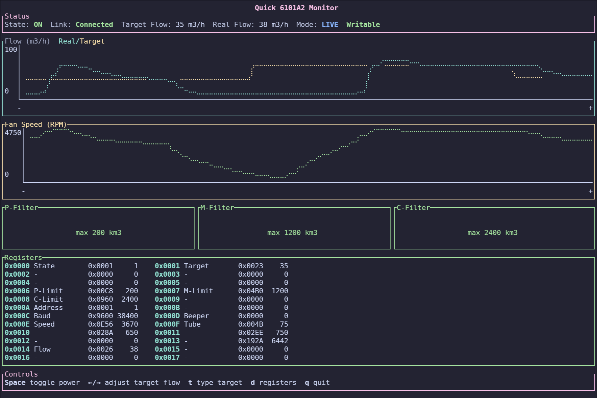

# Quick 6101A2 Monitor

Proof of Concept monitor/controller for the Quick 6101A2 fume extractor over Modbus RTU.



You can find background and technical details from the blog [post](https://nurmi.me/posts/re-quick-6101a2/).

> [!IMPORTANT]
> Use at your own risk.

## Usage

```bash
cargo run -- --port /dev/ttyUSB0
```

Common flags:

- `--port`, `-p`: serial device path
- `--baud`, `-b`: baud rate (default 19200)
- `--address`, `-a`: Modbus address (default 2)
- `--poll-interval`, `-i`: polling interval in ms (default 500)
- `--read-only`, `-r`: does not allow change the state of the device

Debug-only:

- `--simulate`, `-s`: run without a serial device

## Keys

- `Space`: toggle power ON/OFF
- `←/→`: adjust target airflow
- `t`: set target airflow
- `d`: toggle register panel
- `q`: quit
